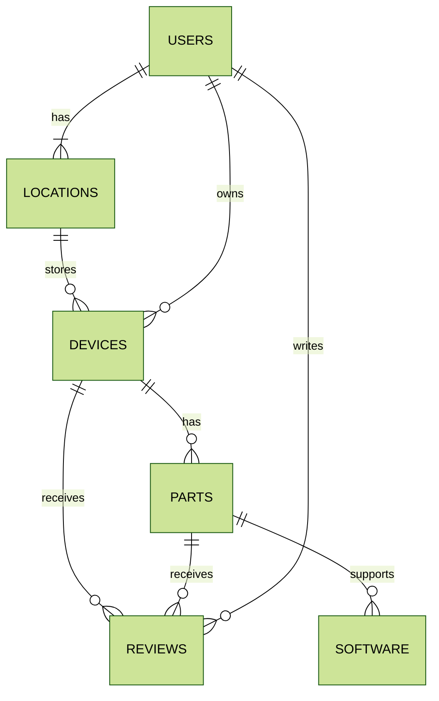

# Transistor Tracker
An application to track personal hardware devices and their specifications, compatibility, and other relevant details.
## Problem Definition
With an increasing number of devices such as personal computers, peripherals, and gaming consoles, it becomes difficult to track their specifications, operating system compatibility, and software restrictions. This tracking application serves as a structured way to record and manage hardware details for easy reference.
## Priorities
### Must Have
- A user must be able to login and logout
- A user must be able to create a new account
- A user must be able to list personal hardware devices and categorise them
- Each device should have relevant specifications recorded
- Compatibility with software should be noted
- Ability to track whether the device is still in use, retired, partially defective or defective
### Should Have
- Shareable hardware lists
- Search filters for device types, OS compatibility, or status (active/retired/partially defective/defective)
### Could Have
- Ability to track warranty and purchase details
- Record of past upgrades (e.g., RAM, SSD upgrades)
- Maintenance history (e.g., repairs, replacements)
- Password reset
- Option to add custom notes per device
### Will Not Have
- Automatic hardware detection or monitoring
## Domain Model Diagram

### USERS
Users represent the individuals using the application. They have attributes such as name, email, and user type, and can own multiple devices, write multiple reviews, and have multiple locations.

### LOCATIONS
Locations represent physical places where devices are stored. They include attributes like name and address, and can store multiple devices and belong to a user.

### DEVICES
Devices are hardware items tracked by the application. They have attributes such as name, model, wattage, colour, wireless capability, and release date, and can have multiple parts, receive multiple reviews, be stored in a location, be owned by a user, and have a condition.

### PARTS
Parts are individual components of a device. They include attributes like name, description, wattage, colour, and release date, and can belong to a device, receive multiple reviews, support multiple software, be categorized under a category, and have a condition.

### SOFTWARE
Software represents applications that can be supported by parts. It includes attributes such as name, version, and release date, and is supported by multiple parts.

### REVIEWS
Reviews are written by users for devices and parts. They include review text, rating, and timestamps, and are associated with a user, a device, and a part.
